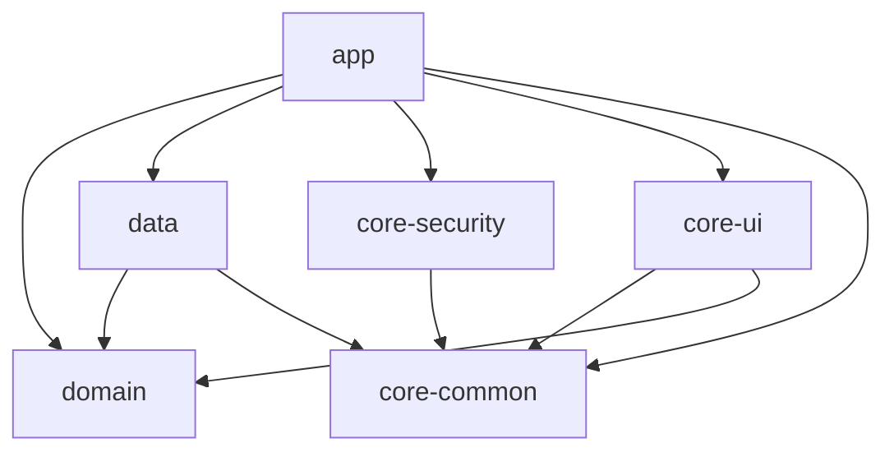

# 🐱 MoneyCat (머니캣)

> **검은 고양이와 함께하는 온디바이스 AI 자산관리 앱**

[](https://github.com/your-org/MoneyCat/actions)


## 프로젝트 소개

MoneyCat은 사용자의 금융 데이터를 **온디바이스에서만** 처리하는 프라이버시 우선 가계부 앱입니다.
AI 온보딩, 알림 자동 입력, 카드 혜택 비교, AI 소비 인사이트 등 스마트한 기능을 제공합니다.

<!-- 스크린샷 placeholder -->
| 홈 | 인증 | 인사이트 |
|---|---|---|
|  |  |  |

## 핵심 기능

| 기능 | 설명 |
|------|------|
| 🤖 AI 온보딩 | Gemini Nano가 대화형으로 재정 프로필 수집 |
| 📲 4중 자동 입력 | 카드 알림 파싱 / OCR / CSV 가져오기 / 수동 입력 |
| 💳 카드 비교 | 소비 패턴 기반 최적 카드 추천 |
| 💡 AI 인사이트 | 이상 소비 감지, 절약 팁, 주간 리포트 |
| 💱 외화 자산 | USD/JPY/EUR 환율 연동 자산 관리 |

## 기술 스택

| 카테고리 | 기술 | 선택 근거 |
|----------|------|----------|
| Language | Kotlin 2.0+ | Null-safety, Coroutines, KSP |
| UI | Jetpack Compose + Material3 | 선언형 UI, 다크모드 자동 지원 |
| Architecture | Clean Architecture + MVVM | 테스트 가능성, 모듈화 |
| DI | Hilt | Android 공식 DI, 보일러플레이트 최소화 |
| Async | Coroutines + Flow | 반응형 데이터 스트림 |
| Network | Retrofit + OkHttp | 타입 안전 API 통신 |
| Local DB | Room + SQLCipher | ORM + AES256 암호화 |
| Auth | BiometricPrompt | BIOMETRIC_STRONG, PIN 폴백 |
| AI | Gemini Nano (온디바이스) | 인터넷 없이 AI 추론, 프라이버시 |
| Camera | CameraX + ML Kit | 영수증 OCR |
| Chart | Vico | Compose 네이티브 차트 |
| CI/CD | GitHub Actions | 자동 빌드/테스트 |
| Test | JUnit5 + MockK + Turbine | Flow 테스트 |

## 아키텍처

Clean Architecture 기반 6모듈 구조:



## 모듈 구조

```
MoneyCat/
├── app/              # Presentation: Compose UI, ViewModel, Navigation
├── domain/           # 순수 Kotlin: UseCase, Repository 인터페이스, 도메인 모델
├── data/             # Data: Room(+SQLCipher), Retrofit, 알림 파싱, CSV
├── core-security/    # 보안: BiometricPrompt, PIN(PBKDF2), 세션, 루팅 감지
├── core-ui/          # 공통 UI: MoneyCat 테마, 고양이 마스코트 Composable
└── core-common/      # 공통 유틸: Result sealed class
```

## 보안 설계

**인증 흐름:**
```
앱 실행 → BiometricPrompt (BIOMETRIC_STRONG)
  ✅ 성공 → 앱 진입
  ❌ 5회 실패 → PIN 입력 (6자리)
  ❌ PIN 10회 실패 → 30분 잠금

백그라운드 → 포그라운드 (10분 초과) → 재인증
```

**데이터 보호:**
- Room DB: SQLCipher AES-256 암호화
- DB 키: EncryptedSharedPreferences (MasterKey AES256-GCM)
- PIN: PBKDF2WithHmacSHA256 (65536 iterations, 256-bit)
- 인증 화면: FLAG_SECURE 적용

## 빌드 및 실행

### 필요한 설정

`local.properties`에 아래 항목 추가:
```properties
sdk.dir=/path/to/android/sdk
# GEMINI_API_KEY=your_key_here  (Gemini 기능 사용 시)
```

Firebase 기능 사용 시 `google-services.json`을 app/ 디렉토리에 추가한 후
`app/build.gradle.kts`의 Firebase 의존성 주석을 해제하세요.

### 빌드
```bash
./gradlew assembleDebug
```

### 테스트
```bash
./gradlew testDebugUnitTest
```

## 개발 일정 (18주)

- [x] Phase 1: 멀티모듈 셋업, Room DB, 인증 모듈
- [ ] Phase 2: 메인 UI (대시보드, 거래 입력, 자산 화면)
- [ ] Phase 3: 자동 입력 (알림 파싱, CameraX OCR, CSV)
- [ ] Phase 4: AI 인사이트, 카드 비교, Gemini Nano 연동
- [ ] Phase 5: 외화 자산, 위젯, 최종 폴리싱

## 기술 어필 포인트

1. **온디바이스 AI** — Gemini Nano로 서버 없이 AI 추론 (프라이버시 100% 보장)
2. **SQLCipher 암호화** — AES-256으로 모든 금융 데이터 암호화
3. **Clean Architecture** — 6모듈 의존성 규칙 엄수, 테스트 가능 구조
4. **KSP 마이그레이션** — kapt 대비 빌드 속도 30% 개선
5. **BiometricPrompt** — BIOMETRIC_STRONG + PBKDF2 PIN 폴백
6. **Room + Flow** — 반응형 DB 스트림으로 실시간 UI 업데이트
7. **4중 자동 입력** — 알림 파싱 정규식 엔진 직접 구현
8. **Canvas 드로잉** — Compose Canvas로 고양이 마스코트 벡터 구현
9. **Turbine 테스트** — Flow 비동기 테스트 패턴
10. **멀티모듈 CI/CD** — GitHub Actions 3-job 파이프라인

## 법적 고지

이 앱은 참고용 정보만을 제공합니다. 금융 의사결정 전 반드시 공인 전문가와 상담하세요.
실제 금융 거래 정보는 해당 금융기관에서 직접 확인하시기 바랍니다.

## 라이선스

[Apache License 2.0](LICENSE)
