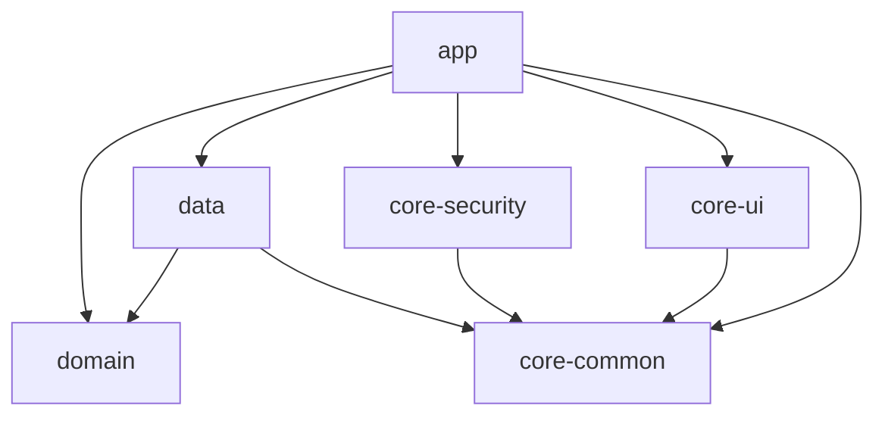

# MoneyCat — Claude Code 프롬프트 모음
> Week 1 구현 작업용 | 2026-04-19
> 사용법: 각 프롬프트를 순서대로 Claude Code에 복사-붙여넣기

---

## 사전 준비

Claude Code 시작 전에 아래 파일들을 프로젝트 루트에 `/docs` 폴더로 복사해두세요.
Claude Code가 설계 문서를 참조하면서 작업할 수 있습니다.

```
프로젝트루트/
├── docs/
│   ├── MoneyCat_PRD_v2.md
│   ├── 02_API_Specification_v2.md
│   ├── 03_Architecture_Design_v2.md
│   └── 04_Security_Legal_v2.md
```

---

## 프롬프트 1: Android 프로젝트 초기 셋업

```
너는 지금부터 "MoneyCat (머니캣)"이라는 Android 앱 프로젝트를 처음부터 셋업할 거야.

## 프로젝트 개요
- 앱 이름: MoneyCat (머니캣)
- 패키지명: com.moneycat.app
- 한 줄 설명: 검은 고양이와 함께하는 온디바이스 AI 자산관리 앱
- 설계 문서: docs/ 폴더에 PRD, API 명세서, 아키텍처 설계서, 보안 설계서가 있으니 반드시 먼저 읽어줘.

## 해야 할 일: 멀티모듈 프로젝트 생성

### 1. 프로젝트 구조
Clean Architecture 기반 6개 모듈을 생성해줘:

```
MoneyCat/
├── app/                    # Presentation Layer (Compose UI)
├── domain/                 # 순수 Kotlin (UseCase, Repository Interface, Domain Model)
├── data/                   # Data Layer (Room, Retrofit, AI, AutoInput)
├── core-security/          # 보안 (BiometricPrompt, PIN, Crypto, Session)
├── core-ui/                # 공통 UI (Theme, 고양이 마스코트 Composable)
└── core-common/            # 공통 유틸 (Formatter, Result)
```

### 2. 모듈별 build.gradle.kts 설정

**공통 설정:**
- Kotlin 2.0+
- compileSdk = 35
- minSdk = 29
- targetSdk = 35
- KSP (kapt 대신)
- version catalog (libs.versions.toml) 사용

**domain 모듈** — Java Library (Android 의존 없음):
```kotlin
plugins {
    id("java-library")
    id("org.jetbrains.kotlin.jvm")
}
dependencies {
    implementation("org.jetbrains.kotlinx:kotlinx-coroutines-core:1.8.1")
    implementation("javax.inject:javax.inject:1")
}
```

**data 모듈:**
- Room 2.6.1 + KSP
- SQLCipher 4.5.6
- Retrofit 2.11.0 + OkHttp 4.12.0 + Gson Converter
- EncryptedSharedPreferences 1.1.0-alpha06
- WorkManager 2.9.1
- OpenCSV 5.9
- Apache POI 5.2.5
- Hilt 2.51.1

**app 모듈:**
- Jetpack Compose (BOM 2024.09.03)
- Material3
- Navigation Compose 2.8.4
- Lifecycle ViewModel Compose 2.8.7
- Lifecycle Runtime Compose 2.8.7
- CameraX 1.4.0 (camera2, lifecycle, view)
- ML Kit Text Recognition Korean 16.0.1
- Vico Chart 2.0.0-beta.2
- Firebase BOM 33.6.0 (analytics, crashlytics, messaging, auth)
- Gemini Nano (play-services-mlkit-genai:1.0.0-beta1)
- Hilt 2.51.1 + hilt-navigation-compose 1.2.0 + hilt-work 1.2.0

**core-security 모듈:**
- BiometricPrompt (androidx.biometric:biometric:1.2.0-alpha05)
- EncryptedSharedPreferences

**core-ui 모듈:**
- Compose (BOM)
- Material3

**core-common 모듈:**
- Android Library (최소 의존)

### 3. 모듈 의존성 규칙 (엄격히 지켜줘)

```
app → domain, data, core-security, core-ui, core-common
data → domain, core-common
core-security → core-common
core-ui → core-common
core-common → (독립)
domain → (독립, 순수 Kotlin)
```

### 4. Hilt 셋업
- app 모듈: @HiltAndroidApp Application 클래스 (MoneyCatApplication)
- 각 모듈에 필요한 Hilt plugin 적용
- NetworkModule, DatabaseModule, RepositoryModule 은 data 모듈에 배치 (빈 껍데기만 만들어둬)

### 5. Compose 테마 — MoneyCat 브랜드 팔레트

core-ui 모듈에 아래 컬러 시스템을 적용한 Material3 테마를 만들어줘:

```
Primary: #C4E2E2 (민트 세이지)
Muted: #B5C3C3 (그레이 민트)
Cat Eye: #9DD8E0 (연하늘)
Cat Body: #2A2A2A (검은 고양이)
BG Light: #E8F4F4
BG Dark: #1E2A2A
Income (수입): #5AB0A0
Expense (지출): #E07070
Warning: #E8A0AA (고양이 코 색)
```

- Light/Dark 테마 모두 정의
- 시스템 다크 모드 추종 (기본) + 수동 전환 가능하도록 설계
- Typography는 기본 Material3 사용하되, 한국어 가독성 좋은 설정

### 6. settings.gradle.kts

```kotlin
include(":app", ":domain", ":data", ":core-security", ":core-ui", ":core-common")
```

### 7. 기타
- .gitignore 생성 (Android 표준 + local.properties + *.jks 등)
- gradle.properties에 AndroidX, KSP, non-transitive R 설정
- local.properties에 API 키 placeholder 주석 추가

## 주의사항
- kapt는 사용하지 마. 전부 KSP로.
- 아직 기능 구현은 하지 마. 모듈 구조 + 빌드 설정 + 테마만 잡아줘.
- 빌드가 성공하는지 반드시 확인해줘.
```

---

## 프롬프트 2: GitHub 레포 + CI/CD 셋업

```
MoneyCat 프로젝트의 GitHub 레포를 위한 파일들을 만들어줘.

## 1. README.md

아래 구조로 README를 작성해줘. 이 README는 면접관이 GitHub에서 바로 보는 문서이기 때문에 기술적으로 인상적이어야 해.

### README 구조:
1. **프로젝트 소개** — 앱 이름, 한 줄 설명, 주요 스크린샷 placeholder
2. **핵심 기능** — 5가지 (AI 온보딩, 4중 자동 입력, 카드 비교, AI 인사이트, 외화 자산)
3. **기술 스택** — 표 형태로 (카테고리 | 기술 | 선택 근거)
4. **아키텍처** — Clean Architecture + MVVM 설명 + Mermaid 다이어그램 (모듈 의존성)
5. **모듈 구조** — 6개 모듈 트리 구조 + 각 모듈 역할 설명
6. **보안 설계** — 인증 흐름, 데이터 암호화, 프라이버시 설명
7. **빌드 및 실행** — 필요한 API 키 + 빌드 방법
8. **개발 일정** — Phase 1~5 (18주) 체크리스트
9. **면접 대비 기술 포인트** — 이 프로젝트에서 어필할 수 있는 기술 주제 10개
10. **법적 고지** — 면책 조항 요약
11. **라이선스** — Apache 2.0

### Mermaid 다이어그램 (모듈 의존성):


### 기술 스택 표에 포함할 항목:
- Language: Kotlin 2.0+
- UI: Jetpack Compose + Material3
- Architecture: Clean Architecture + MVVM
- DI: Hilt
- Async: Coroutines + Flow
- Network: Retrofit + OkHttp
- Local DB: Room + SQLCipher
- Auth: BiometricPrompt
- AI: Gemini Nano (온디바이스)
- Camera: CameraX + ML Kit
- Chart: Vico
- CI/CD: GitHub Actions
- Test: JUnit5 + MockK + Turbine

## 2. GitHub Actions CI 워크플로우

`.github/workflows/ci.yml` 파일을 만들어줘:

- 트리거: push (main, develop), PR (main, develop)
- Job 1: lint (ktlint 또는 detekt)
- Job 2: unit-test (./gradlew testDebugUnitTest)
- Job 3: build (./gradlew assembleDebug)
- Java 17, Gradle 캐싱 적용
- API 키는 GitHub Secrets에서 주입 (placeholder)

## 3. .gitignore

Android 표준 + 추가:
- local.properties
- *.jks / *.keystore
- /docs/ 폴더 안의 개인 메모 (*.draft.md)
- google-services.json (각자 발급)

## 4. CONTRIBUTING.md

간단한 컨트리뷰션 가이드:
- 브랜치 전략: main (배포) / develop (개발) / feature/* / bugfix/*
- 커밋 메시지: Conventional Commits (feat:, fix:, docs:, refactor:, test:)
- PR 템플릿: 변경 내용, 스크린샷, 체크리스트

## 5. PR 템플릿

`.github/pull_request_template.md`:
- 변경 내용 요약
- 관련 이슈 번호
- 스크린샷 (UI 변경 시)
- 체크리스트: 빌드 확인 / 테스트 추가 / 면책 조항 확인 (금융 관련 기능)
```

---

## 프롬프트 3: Room DB 초기 스키마

```
MoneyCat 프로젝트의 Room Database 초기 스키마를 구현해줘.
설계 문서는 docs/MoneyCat_PRD_v2.md의 "7. 데이터 모델" 섹션을 참조해줘.

## 해야 할 일

### 1. Entity 클래스 8개 생성 (data 모듈 → local/db/entity/)

아래 Entity를 모두 만들어줘. PRD에 정의된 필드를 그대로 따라가되,
Room 어노테이션 + TypeConverter를 정확히 적용해줘.

1. **UserProfileEntity** — 싱글톤 (PK = 1), AI 온보딩 프로필
2. **AssetEntity** — 자산 (유형, 통화, 잔액)
3. **TransactionEntity** — 거래 내역 (인덱스: date, cardId, category)
   - source: InputSource enum (MANUAL, NOTIFICATION, OCR, CSV)
   - dedupHash: String? (중복 감지용)
   - merchantName: String? (알림 파싱용)
4. **CardEntity** — 카드 (isActive로 soft delete)
5. **CardBenefitEntity** — 카드 혜택 (ForeignKey → cards, CASCADE)
6. **BudgetEntity** — 예산 (unique index: category + yearMonth)
7. **ExchangeRateEntity** — 환율 캐시 (PK = currencyPair, source 필드)
8. **AiInsightEntity** — AI 인사이트 (estimatedSaving 필드 포함)
9. **NotificationRuleEntity** — 알림 파싱 규칙

### 2. Enum 클래스 (data 모듈 → local/db/entity/)

- AssetType: CASH, DEPOSIT, SAVINGS, STOCK, FOREIGN_CURRENCY, OTHER
- Currency: KRW, USD, JPY, EUR
- TransactionType: INCOME, EXPENSE
- PaymentMethod: CASH, CARD, TRANSFER
- CardType: CREDIT, DEBIT, PREPAID
- BenefitType: DISCOUNT, CASHBACK, POINT
- InputSource: MANUAL, NOTIFICATION, OCR, CSV
- InsightType: SPENDING_ALERT, SAVING_TIP, CARD_SUGGESTION, ANOMALY, WEEKLY_SUMMARY

### 3. TypeConverter

Room이 enum, BigDecimal, LocalDate, LocalDateTime, YearMonth을 저장할 수 있도록
TypeConverter 클래스를 만들어줘.

```kotlin
class Converters {
    // BigDecimal ↔ String
    // LocalDate ↔ String (ISO format)
    // LocalDateTime ↔ String (ISO format)
    // enum ↔ String (name)
}
```

### 4. DAO 인터페이스 7개 (data 모듈 → local/db/dao/)

각 DAO에 기본 CRUD + 핵심 쿼리를 만들어줘:

**TransactionDao:**
- insert, delete, getAll (Flow)
- getMonthlyCategoryTotals(startDate, endDate) → Flow<List<CategoryTotal>>
- getMonthlyCardSpending(startDate, endDate) → Flow<List<CardSpending>>
- getCategoryComparison(thisStart, thisEnd, lastStart, lastEnd)
- existsByHash(hash: String): Boolean
- insertAll(list: List<TransactionEntity>)

**AssetDao:**
- insert, update, delete, getAll (Flow)
- getTotalByType → Flow<List<AssetTypeTotal>>

**CardDao:**
- insert, update, getActiveCards (Flow)
- getCardWithBenefits(cardId) → Flow<CardWithBenefits>
- softDelete(cardId)

**CardBenefitDao:**
- insertAll, deleteByCardId

**BudgetDao:**
- upsert, getByMonth(yearMonth) → Flow<List<BudgetEntity>>
- getByCategoryAndMonth(category, yearMonth) → Flow<BudgetEntity?>

**ExchangeRateDao:**
- upsert, getByCurrencyPair(pair) → ExchangeRateEntity?
- getAll → Flow<List<ExchangeRateEntity>>

**AiInsightDao:**
- insert, getAll (Flow), getUnread (Flow)
- markAsRead(id), getLatest → Flow<AiInsightEntity?>

**UserProfileDao:**
- upsert, get → Flow<UserProfileEntity?>

**NotificationRuleDao:**
- insertAll, getAll, findByPackage(packageName) → NotificationRuleEntity?
- getEnabled → List<NotificationRuleEntity>

### 5. Relation 클래스

```kotlin
data class CardWithBenefits(
    @Embedded val card: CardEntity,
    @Relation(parentColumn = "id", entityColumn = "cardId")
    val benefits: List<CardBenefitEntity>
)
```

### 6. MoneyCatDatabase 클래스

```kotlin
@Database(
    entities = [
        UserProfileEntity::class,
        AssetEntity::class,
        TransactionEntity::class,
        CardEntity::class,
        CardBenefitEntity::class,
        BudgetEntity::class,
        ExchangeRateEntity::class,
        AiInsightEntity::class,
        NotificationRuleEntity::class,
    ],
    version = 1,
    exportSchema = true
)
@TypeConverters(Converters::class)
abstract class MoneyCatDatabase : RoomDatabase() {
    abstract fun transactionDao(): TransactionDao
    abstract fun assetDao(): AssetDao
    abstract fun cardDao(): CardDao
    abstract fun cardBenefitDao(): CardBenefitDao
    abstract fun budgetDao(): BudgetDao
    abstract fun exchangeRateDao(): ExchangeRateDao
    abstract fun aiInsightDao(): AiInsightDao
    abstract fun userProfileDao(): UserProfileDao
    abstract fun notificationRuleDao(): NotificationRuleDao
}
```

### 7. DatabaseModule (Hilt)

```kotlin
@Module
@InstallIn(SingletonComponent::class)
object DatabaseModule {
    @Provides @Singleton
    fun provideDatabase(@ApplicationContext context: Context): MoneyCatDatabase {
        val passphrase = CryptoManager.getDatabasePassphrase(context)
        return Room.databaseBuilder(context, MoneyCatDatabase::class.java, "moneycat.db")
            .openHelperFactory(SupportFactory(passphrase))
            .build()
    }

    @Provides fun provideTransactionDao(db: MoneyCatDatabase) = db.transactionDao()
    @Provides fun provideAssetDao(db: MoneyCatDatabase) = db.assetDao()
    // ... 나머지 DAO도 모두
}
```

### 8. 초기 알림 파싱 규칙 데이터

앱 첫 실행 시 Room Callback으로 8개 카드사 규칙을 자동 삽입해줘.
docs/02_API_Specification_v2.md의 "6. 알림 파싱 시스템" 섹션을 참조해서
8개 카드사(신한, 삼성, 현대, KB, 롯데, 하나, 우리, BC)의 규칙을 prepopulate.

## 주의사항
- BigDecimal은 Room에서 직접 지원하지 않으므로 String으로 변환하는 TypeConverter 필수
- LocalDate/LocalDateTime도 마찬가지 (java.time 사용, Desugaring 적용)
- @ForeignKey onDelete = CASCADE 잊지 마
- exportSchema = true로 설정 (스키마 버전 관리)
- 모든 DAO 메서드에서 Flow를 반환하는 것은 SELECT 쿼리만. INSERT/UPDATE/DELETE는 suspend fun.
- 빌드가 성공하는지 확인해줘.
```

---

## 프롬프트 4: 인증 모듈 구현

```
MoneyCat 프로젝트의 인증 시스템을 구현해줘.
docs/04_Security_Legal_v2.md와 docs/03_Architecture_Design_v2.md를 참조해줘.

## 인증 흐름 (PRD 기준)

```
앱 실행
  → BiometricPrompt 표시
  → 성공: 앱 진입
  → 실패 5회: PIN 입력 화면
  → PIN 실패 10회: 앱 잠금 (30분)
  
앱 백그라운드 → 포그라운드
  → 10분 이내: 바로 진입
  → 10분 초과: 재인증 요구 (세션 만료)
```

## 해야 할 일

### 1. core-security 모듈에 구현할 클래스들

**BiometricAuthManager.kt:**
- BiometricManager.canAuthenticate(BIOMETRIC_STRONG)로 지원 여부 확인
- BiometricPrompt.PromptInfo 설정:
  - 제목: "머니캣 잠금 해제"
  - 부제: "생체 인증으로 앱에 진입합니다"
  - 네거티브 버튼: "PIN 입력"
- 콜백: onAuthenticationSucceeded, onAuthenticationFailed, onAuthenticationError
- Hilt @Inject 가능하도록

**PinAuthManager.kt:**
- PIN 설정: salt 생성 (SecureRandom 16바이트) + PBKDF2WithHmacSHA256 해싱 (65536 iterations, 256bit)
- PIN 검증: salt:hash 형태로 EncryptedSharedPreferences에 저장
- 실패 카운트: 10회 초과 시 30분 잠금 (잠금 해제 시각을 저장)
- 잠금 상태 확인: isLocked(), getRemainingLockMinutes()
- PinResult sealed interface: Success, NotSet, Wrong(remaining), Locked(minutes)

**SessionManager.kt:**
- 백그라운드 진입 시각 기록 (SharedPreferences, 암호화 불필요)
- isSessionExpired(): 현재 시각 - 마지막 활동 > 10분
- updateLastActive(): 호출 시 시각 갱신
- SESSION_TIMEOUT_MS = 10 * 60 * 1000L

**CryptoManager.kt:**
- EncryptedSharedPreferences 래퍼 (MasterKey AES256_GCM)
- saveEncrypted(key, value), getEncrypted(key)
- getDatabasePassphrase(): DB 암호화 키 생성/조회
- hashPin(pin, salt): PBKDF2 해싱
- generateSalt(): SecureRandom 16바이트 Base64

**RootDetector.kt:**
- su 바이너리 존재 확인 (/system/bin/su, /system/xbin/su, /sbin/su 등)
- 루팅 앱 패키지 확인 (Magisk, SuperSU 등)
- Build.TAGS test-keys 확인
- isRooted(): Boolean

**ScreenSecurityManager.kt:**
- FLAG_SECURE 적용/해제 유틸
- Compose용 SecureScreen Composable (DisposableEffect)

### 2. app 모듈에 구현할 화면들

**AuthScreen.kt (Compose):**
- 최초 실행: PIN 설정 화면 (6자리 입력 + 확인)
- 이후 실행: 생체인증 시도 → 실패 시 PIN 입력
- 잠금 상태: 남은 시간 표시 + 재시도 불가
- 고양이 마스코트 표시 (잠금 화면에 Sleeping 표정)
- PIN 입력 시 숫자 키패드 커스텀 UI (Material3)
- 입력된 자리수 표시: ● ● ● ○ ○ ○ (6자리)

**AuthViewModel.kt:**
- UiState: Authenticating, PinInput, PinSetup, Locked(remainingMinutes), Authenticated
- BiometricAuthManager, PinAuthManager, SessionManager 주입
- 생체인증 결과 처리
- PIN 입력/검증 로직
- 세션 만료 체크 (앱 포그라운드 복귀 시)

### 3. MoneyCatApplication.kt 수정

- ProcessLifecycleOwner 등록
- onStop에서 SessionManager.updateLastActive() 호출
- 루팅 감지 (isRooted() → 경고 다이얼로그 or 제한)

### 4. Navigation 연동

- AuthScreen을 startDestination으로 설정
- 인증 성공 시 Dashboard로 이동 (popUpTo Auth inclusive)
- 세션 만료 시 Auth로 강제 이동

### 5. 테스트

**PinAuthManagerTest.kt:**
- PIN 설정 → 검증 성공
- 잘못된 PIN → Wrong(remaining=9)
- 10회 실패 → Locked
- 잠금 시간 경과 후 → 재시도 가능
- PIN 미설정 → NotSet

**SessionManagerTest.kt:**
- 10분 이내 → isSessionExpired() = false
- 10분 초과 → isSessionExpired() = true
- updateLastActive 후 → false

## UI 디자인 가이드

- 배경: #E8F4F4 (라이트), #1E2A2A (다크)
- PIN 입력 원: 미입력 ○ = #B5C3C3 테두리, 입력 ● = #C4E2E2 채움
- 키패드: Material3 FilledTonalButton 스타일
- 잠금 화면: 고양이 Sleeping 이미지 + "30분 후에 다시 시도해주세요" + 남은 시간 카운트다운
- 생체인증 실패 시 고양이 Alert 표정으로 전환
- FLAG_SECURE 모든 인증 화면에 적용

## 주의사항
- EncryptedSharedPreferences는 메인 스레드에서 초기화하면 ANR 발생할 수 있어. lazy 초기화 사용.
- BiometricPrompt는 FragmentActivity 컨텍스트가 필요해. Compose에서는 LocalContext.current as FragmentActivity.
- 실제 PIN 값은 절대 평문 저장하지 마. 반드시 PBKDF2 해싱.
- 테스트 코드도 반드시 작성해줘.
- 빌드 + 테스트 통과 확인해줘.
```

---

## 프롬프트 5 (보너스): 고양이 마스코트 Composable

```
MoneyCat 프로젝트의 고양이 마스코트 Composable을 core-ui 모듈에 만들어줘.

## 마스코트 사양

검은 고양이 캐릭터로, 앱 상태에 따라 5가지 표정을 가져:

### 표정 (CatExpression enum)
1. DEFAULT — 기본 (동공 보통, 입 닫힘)
2. HAPPY — 기쁨 (눈 감고 웃음, 볼 빨개짐) — 예산 달성, 절약 성공
3. ALERT — 경고 (동공 확장, 입 벌림) — 예산 초과, 이상 소비
4. THINKING — 생각 중 (한쪽 눈썹 올림, 살짝 찡그림) — AI 분석 중
5. SLEEPING — 자는 중 (눈 감고 zzz) — 앱 미사용, 빈 상태

### 컬러
- 고양이 몸: #2A2A2A ~ #333333
- 눈동자 바깥: #9DD8E0
- 눈동자 안쪽: #C4E2E2
- 동공: #1A1A1A
- 눈 하이라이트: #FFFFFF (opacity 0.8)
- 코: #E8A0AA
- 수염: #555555

### Composable 설계

```kotlin
@Composable
fun CatMascot(
    expression: CatExpression,
    modifier: Modifier = Modifier,
    size: Dp = 80.dp
)
```

- Canvas로 직접 그려줘 (벡터 드로잉)
- 표정 전환 시 animateFloatAsState로 부드럽게 전환
- 크기 조절 가능 (size 파라미터)
- Preview 5개 (각 표정별)

### CatExpressionResolver

```kotlin
class ResolveCatExpressionUseCase @Inject constructor(...) {
    operator fun invoke(summary: MonthlySummary): CatExpression {
        // 예산 초과 → ALERT
        // 예산 80% 이상 → DEFAULT
        // 지출 전월 대비 10% 이상 감소 → HAPPY
        // 7일간 거래 없음 → SLEEPING
        // 기본 → DEFAULT
    }
}
```

이 UseCase는 domain 모듈에 배치해줘 (CatExpression enum도 domain에).
```

---

## 사용 순서 요약

| 순서 | 프롬프트 | 예상 소요 | 결과물 |
|------|---------|----------|--------|
| 1 | 프로젝트 셋업 | 30분 | 빌드 가능한 6모듈 프로젝트 |
| 2 | GitHub + CI/CD | 15분 | README + Actions + PR템플릿 |
| 3 | Room DB 스키마 | 45분 | 9 Entity + 9 DAO + DB 클래스 |
| 4 | 인증 모듈 | 1시간 | 생체/PIN/세션 + 화면 + 테스트 |
| 5 | 고양이 마스코트 | 30분 | CatMascot Composable + Preview |

**각 프롬프트 실행 후 반드시 `./gradlew assembleDebug`로 빌드 확인!**
